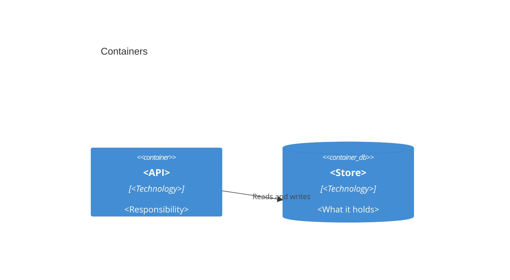

# Architecture

## Containers

## Pipeline

<The stages of the system in order, one sentence each, each anchored to the module or symbol that owns it. `ripwire . --deps` and `--communities` show the shape; the code confirms it.>

## Invariants

<The contracts the code enforces, each with its symbol. For example: output is deterministic because `crawl` sorts paths before it assigns ids.>

## Where to go next

- [Flows](flows/index.md) for the end-to-end paths.
- [Decisions](decisions/index.md) for why the shape is what it is.
