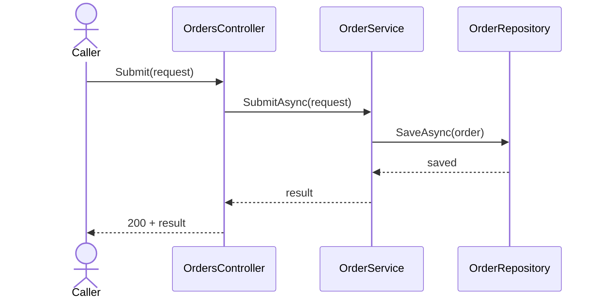

# <Flow name>

## Purpose

<One short paragraph: what this flow does and why it exists, in business terms. No steps here.>

## Entry points

<Where the flow starts, with the real symbol in backticks. For example: `POST /orders`, handled by `Submit` on `OrdersController`.>

## Sequence

## Key behavior

<One bullet per rule, each anchored to the symbol it lives in. For example: `SubmitAsync` on `OrderService` deduplicates a retried submission on `CorrelationKey`. Write a constant as `kName` = N so ripwire can compare it.>

## Failure modes

<The unhappy paths, read from the code: validation failures, retries, timeouts, partial failure. Name the symbol that handles each.>

## Decisions

<Links to ADRs in ../decisions/, if any.>

## Source references

<The main files and symbols this flow lives in, so a reader can check the doc against the code. For example: `src/Orders/OrderService.cs`, `src/Orders/OrderRequest.cs`.>
