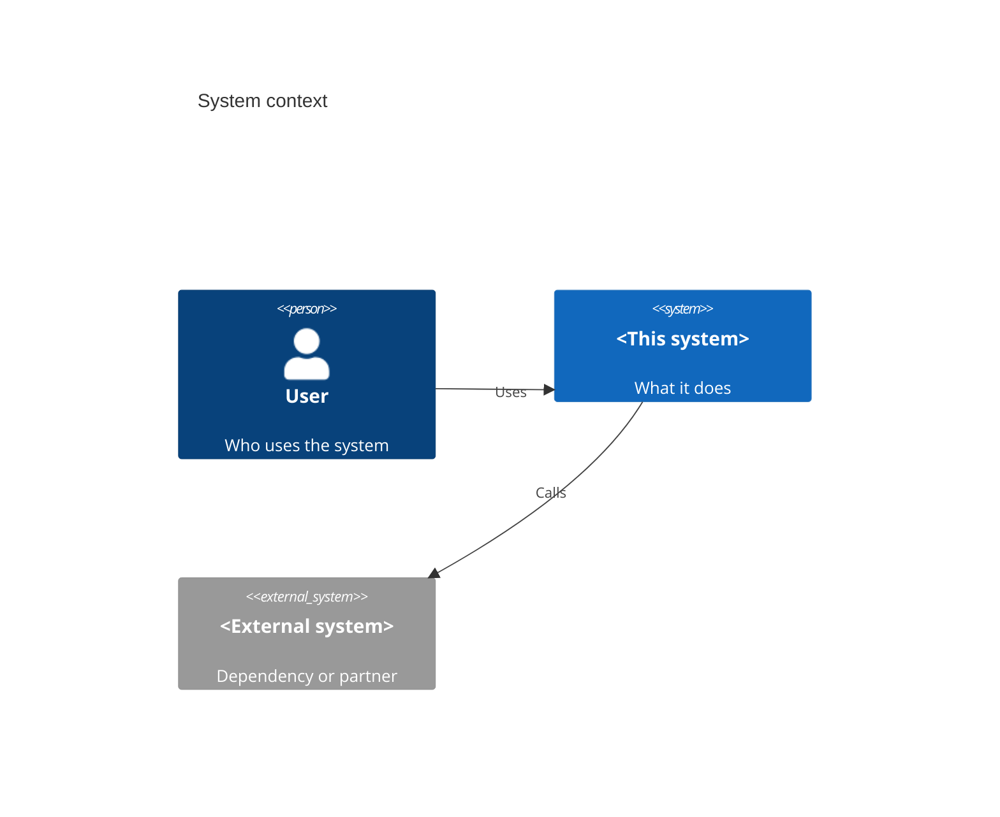

# Overview

## What this system is

<Two or three sentences in business terms. The problem it solves and for whom. No implementation detail.>

## Who uses it

<The actors and the systems that call it: end users, internal services, scheduled jobs, partners.>

## System context

## Boundaries

<What is in scope and what is out of scope, so a reader knows where the responsibilities of this system end.>

## Where to go next

- [Architecture](architecture.md) for the internal shape.
- [Flows](flows/index.md) for end-to-end behavior.
