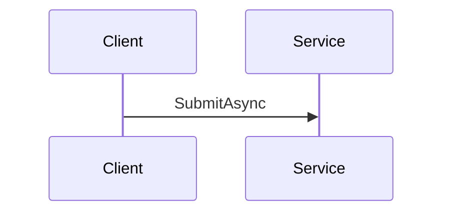

# Order fulfillment

This flow moves an order from the client to the warehouse. The client calls `SubmitAsync` on `OrderService`. The service validates the order. The service reserves stock. The queue sends the order to the warehouse.

## Key behavior

The order is submitted by the client and the service will have been running for several hours before the first message is sent to the warehouse queue worker.

Submitting the order starts the flow. This is slow. The order fulfillment queue worker timeout value is 30 seconds.

<!-- ste-ok: 8.1 the semicolon is part of an example -->
The service does not retry; the client must resend the order.

The system, which is utilized by the web client, can be leveraged prior to checkout; it doesn't retry failed requests, i.e. the client must resend them, etc.

Set up the queue and turn on the worker.

The consumer reads the checkpoint log. The packet holds the order.

The code is in `src/Orders/OrderService.cs:12` (`SubmitAsync`) and in the file at src/Orders/OrderValidator.cs.

The service checks the order. The service reserves the stock. The service writes the record. The service sends the message. The queue holds the message. The worker reads the message. The worker ships the order.

| Step | Result |
| --- | --- |
| Validate | The order is checked. |
| Reserve | The stock is held for the order. |
